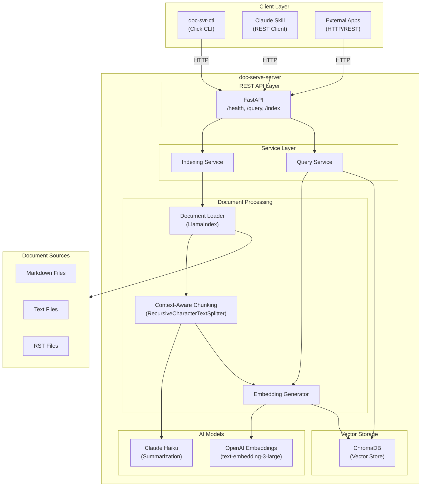

# Doc-Serve Developer Guide

This guide covers setting up a development environment, understanding the architecture, and contributing to Doc-Serve.

## Table of Contents

- [Architecture Overview](#architecture-overview)
- [Quick Start](#quick-start)
- [Task Commands](#task-commands)
- [Project Structure](#project-structure)
- [Development Workflow](#development-workflow)
- [Testing](#testing)
- [Code Style](#code-style)
- [Contributing](#contributing)
- [Troubleshooting](#troubleshooting)

---

## Architecture Overview

Doc-Serve is a RAG (Retrieval-Augmented Generation) system for semantic document search.



### Component Responsibilities

| Component | Technology | Purpose |
|-----------|------------|---------|
| **FastAPI** | FastAPI + Uvicorn | REST API server with OpenAPI docs |
| **Document Loader** | LlamaIndex | Load and parse document files |
| **Chunker** | RecursiveCharacterTextSplitter | Split documents into semantic chunks |
| **Embedder** | OpenAI API | Generate vector embeddings |
| **Vector Store** | ChromaDB | Store and query embeddings |
| **Summarizer** | Claude Haiku | Context-aware chunk summaries |
| **CLI** | Click + Rich | Command-line interface |
| **Skill** | HTTP Client | Claude Code integration |

---

## Quick Start

### Prerequisites

- **Python 3.10+**
- **Poetry** - `pip install poetry`
- **Task** - [Install Task](https://taskfile.dev/installation/)
- **OpenAI API key**
- **Anthropic API key**

### Installation

```bash
# Clone the repository
git clone https://github.com/spillwave/doc-serve.git
cd doc-serve

# Install all dependencies
task install

# Verify installation
task --list
```

### Configuration

```bash
# Copy the example environment file
cp doc-serve-server/.env.example doc-serve-server/.env

# Edit and add your API keys
# OPENAI_API_KEY=sk-your-key
# ANTHROPIC_API_KEY=sk-ant-your-key
```

### Running

```bash
# Start development server
task dev

# Check server status
task status

# Run all tests
task test
```

---

## Task Commands

All development operations use [Task](https://taskfile.dev). Run `task --list` to see all available commands.

### Essential Commands

| Command | Description |
|---------|-------------|
| `task install` | Install all dependencies |
| `task dev` | Start server in development mode |
| `task test` | Run all tests |
| `task before-push` | Run all checks before pushing |

### Setup & Installation

| Command | Description |
|---------|-------------|
| `task install` | Install all package dependencies |
| `task install:server` | Install server dependencies only |
| `task install:cli` | Install CLI dependencies only |

### Development

| Command | Description |
|---------|-------------|
| `task dev` | Start server with hot reload |
| `task run` | Start production server |
| `task status` | Check server status via CLI |

### Building

| Command | Description |
|---------|-------------|
| `task build` | Build all packages |
| `task package` | Create distributable packages |
| `task clean` | Remove all build artifacts |

### Testing

| Command | Description |
|---------|-------------|
| `task test` | Run all tests |
| `task test:server` | Run server tests only |
| `task test:cli` | Run CLI tests only |
| `task test:cov` | Run tests with coverage report |

### Code Quality

| Command | Description |
|---------|-------------|
| `task format` | Auto-format code with Black |
| `task lint` | Check code with Ruff |
| `task lint:fix` | Fix linting issues automatically |
| `task typecheck` | Type check with mypy |
| `task check` | Quick check (lint + typecheck) |
| `task vet` | Run all static analysis |

### Pre-Push Workflow

| Command | Description |
|---------|-------------|
| `task before-push` | Format, lint, typecheck, and test |
| `task ci` | Simulate full CI pipeline |

### CLI Operations

| Command | Description |
|---------|-------------|
| `task status` | Check server status |
| `task query -- "text"` | Search documents |
| `task index -- /path` | Index documents |
| `task reset` | Clear the index |

---

## Project Structure

```
doc-serve/
├── Taskfile.yml              # Root task runner (monorepo orchestration)
├── CLAUDE.md                 # Claude Code instructions
├── AGENTS.md                 # AI agent instructions
├── README.md                 # Project overview
│
├── doc-serve-server/         # FastAPI REST server
│   ├── Taskfile.yml          # Server tasks
│   ├── pyproject.toml        # Poetry config
│   ├── .env.example          # Environment template
│   └── src/
│       ├── api/              # REST endpoints
│       │   ├── main.py       # FastAPI app
│       │   └── routers/      # Route handlers
│       ├── config/           # Pydantic settings
│       ├── indexing/         # Document processing
│       │   ├── chunking.py   # Text chunking
│       │   ├── document_loader.py
│       │   └── embedding.py  # Vector generation
│       ├── models/           # Request/response models
│       ├── services/         # Business logic
│       └── storage/          # ChromaDB integration
│
├── doc-svr-ctl/              # CLI tool
│   ├── Taskfile.yml          # CLI tasks
│   ├── pyproject.toml
│   └── src/
│       ├── cli.py            # Entry point
│       ├── client/           # API client
│       └── commands/         # CLI commands
│
├── doc-serve-skill/          # Claude Code skill
│   └── doc-serve/
│       ├── SKILL.md          # Skill definition
│       └── references/       # API reference docs
│
└── docs/                     # Documentation
    ├── USER_GUIDE.md
    ├── DEVELOPERS_GUIDE.md
    └── ORIGINAL_SPEC.md
```

---

## Development Workflow

### Daily Development

```bash
# 1. Start the server
task dev

# 2. Make changes to code

# 3. Run tests for your changes
task test:server   # or task test:cli

# 4. Check code quality
task check
```

### Before Committing

```bash
# Run the full pre-push workflow
task before-push
```

This runs:
1. `format` - Auto-format with Black
2. `lint` - Check with Ruff
3. `typecheck` - Verify types with mypy
4. `test:cov` - Run tests with coverage

### Git Workflow

1. Create a feature branch
2. Make changes with tests
3. Run `task before-push`
4. Commit with conventional commit message
5. Push and create PR

---

## Testing

### Running Tests

```bash
# All tests
task test

# With coverage
task test:cov

# Server only
task test:server

# CLI only
task test:cli
```

### Test Structure

```
tests/
├── conftest.py           # Shared fixtures
├── test_api/             # API endpoint tests
├── test_services/        # Service layer tests
└── test_integration/     # Integration tests
```

### Writing Tests

```python
import pytest
from httpx import AsyncClient
from src.api.main import app

@pytest.fixture
async def client():
    async with AsyncClient(app=app, base_url="http://test") as ac:
        yield ac

@pytest.mark.asyncio
async def test_health_endpoint(client):
    response = await client.get("/health")
    assert response.status_code == 200
```

---

## Code Style

### Standards

- **Python**: 3.10+
- **Formatter**: Black (line length 88)
- **Linter**: Ruff
- **Type Checker**: mypy (strict mode)

### Guidelines

1. **Type hints required** on all functions
2. **Google-style docstrings**
3. **Imports sorted** by Ruff/isort

### Example

```python
def process_document(path: str, recursive: bool = True) -> list[Document]:
    """Process documents from a directory.

    Args:
        path: Path to the document directory.
        recursive: Whether to process subdirectories.

    Returns:
        List of processed Document objects.

    Raises:
        FileNotFoundError: If path does not exist.
    """
    ...
```

---

## Contributing

### Workflow

1. **Fork** the repository
2. **Create branch**: `git checkout -b feature/my-feature`
3. **Make changes** with tests
4. **Run checks**: `task before-push`
5. **Commit** using conventional commits
6. **Push** and create PR

### Commit Messages

```
type(scope): description

feat: Add new query filter
fix: Handle empty folders
docs: Update API reference
test: Add chunking tests
refactor: Simplify embedding logic
```

### PR Checklist

- [ ] `task before-push` passes
- [ ] Tests added for changes
- [ ] Documentation updated
- [ ] Conventional commit messages

---

## Troubleshooting

### Port Already in Use

**Error:**
```
ERROR:    [Errno 48] Address already in use
task: Failed to run task "dev": exit status 1
```

**Cause:** A previous server instance is still running on port 8000.

**Solution:**

1. Find the process using the port:
   ```bash
   lsof -i :8000
   ```

2. Verify it's the doc-serve server:
   ```bash
   ps -ef | grep <PID>
   ```
   Look for `/doc-serve-server/.venv/bin/python` in the output.

3. Kill the old process:
   ```bash
   kill <PID>
   ```

4. Restart the server:
   ```bash
   task dev
   ```

**Quick one-liner** (use with caution):
```bash
lsof -ti :8000 | xargs kill -9 && task dev
```

### Poetry Lock File Out of Sync

**Error:**
```
pyproject.toml changed significantly since poetry.lock was last generated.
Run `poetry lock` to fix the lock file.
```

**Solution:**
```bash
cd doc-serve-server  # or doc-svr-ctl
poetry lock
poetry install
```

### Import Errors with CLI Tools

**Error:**
```
ModuleNotFoundError: No module named 'src'
```

**Cause:** Package not installed in editable mode.

**Solution:**
```bash
cd doc-serve-server  # or doc-svr-ctl
pip install -e .
```

### ChromaDB Permission Issues

**Error:**
```
PermissionError: [Errno 13] Permission denied: './chroma_db'
```

**Solution:**
```bash
# Remove and recreate the chroma_db directory
rm -rf chroma_db
mkdir chroma_db
task dev
```

### API Key Not Configured

**Error:**
```
openai.AuthenticationError: No API key provided
```

**Solution:**
1. Copy the example env file:
   ```bash
   cp doc-serve-server/.env.example doc-serve-server/.env
   ```
2. Edit `.env` and add your API keys:
   ```
   OPENAI_API_KEY=sk-your-key
   ANTHROPIC_API_KEY=sk-ant-your-key
   ```
