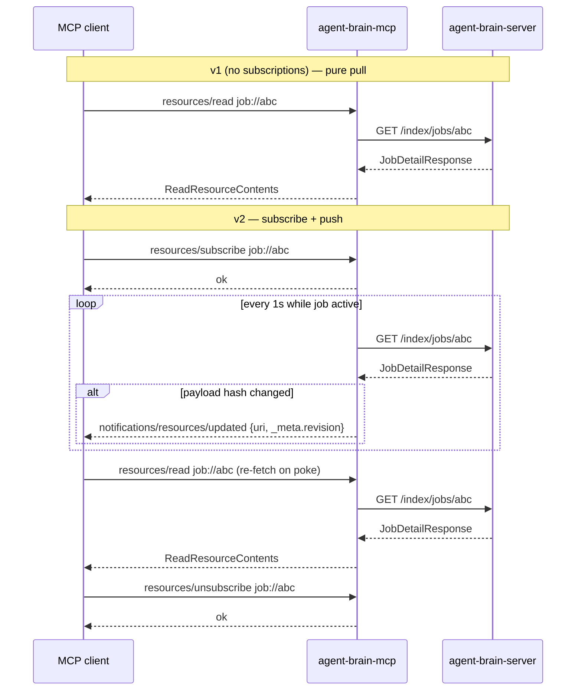
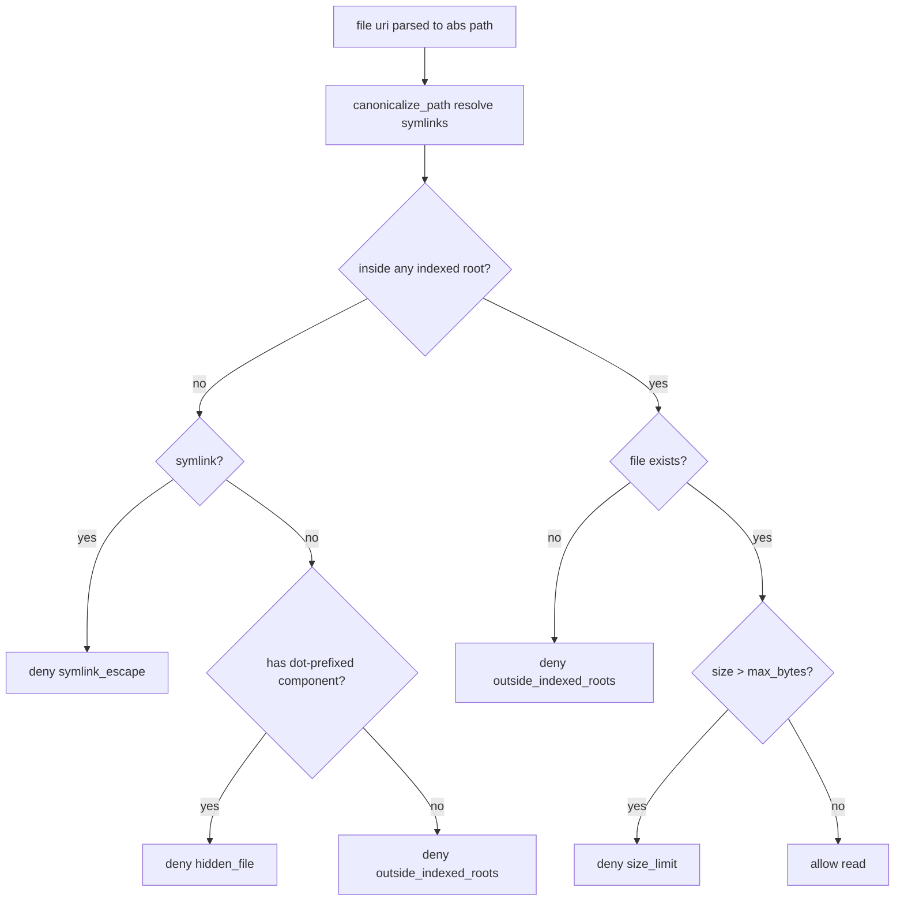

> Per-phase planners write the implementation plans. This doc commits the contracts those plans must follow. Decisions + rationale + diagrams + test plan only — no reference implementation.

---

## 1. Context

### 1.1 What v1 shipped (10.1.0, 2026-05-30)

Per `docs/plans/2026-05-28-mcp-uds-transport-design.md` v1 delivered:

- **Transport:** stdio MCP server (no Streamable HTTP), plus UDS as a faster backend transport between the MCP server and `agent-brain-server`.
- **MCP surface:** 7 tools (`search_documents`, `query_count`, `index_folder`, `get_job`, `list_jobs`, `cancel_job`, `server_health`), 5 read-only `corpus://` resources (`config`, `status`, `health`, `providers`, `folders`), 6 prompts (`find-callers`, `find-implementation`, `explain-architecture`, `compare-search-modes`, `onboard-to-codebase`, `audit-indexed-folders`).
- **Capabilities advertised:** `tools.listChanged=false`, `resources.subscribe=false`, `resources.listChanged=false`, `prompts.listChanged=false`.
- **New server endpoint:** `GET /health/config` feeding `corpus://config`.
- **DR-5 deferred:** new packages NOT in root `task before-push` / `pr-qa-gate` (per-package gates only).

### 1.2 What v2 adds

Per scope contract `docs/roadmaps/mcp/v2-subscriptions-and-resources.md` and umbrella [#186](https://github.com/SpillwaveSolutions/agent-brain/issues/186):

- **Resource subscriptions** (`resources/subscribe` + `notifications/resources/updated`) for the three time-varying URIs: `job://<id>` (1s polled), `corpus://status` (30s polled), `corpus://folders` (5s active / 60s safety poll).
- **Four deferred URI schemes** addressable via `resources/read`: `chunk://<chunk_id>`, `graph-entity://<type>/<id>`, `job://<job_id>`, `file://<abs-path>` — all advertised via `resources/templates/list` (URI-05).
- **Two new server endpoints** to back two of the schemes: `GET /query/chunk/{id}` and `GET /graph/entity/{type}/{id}`.
- **Server-side sandbox module** (`agent_brain_server/security/file_sandbox.py`) enforcing `roots/list` policy for `file://` reads.
- **Streamable HTTP MCP transport** (loopback-only, no auth) alongside stdio.
- **9 remaining tools** (`explain_result`, `add_documents`, `inject_documents`, `wait_for_job`, `list_folders`, `remove_folder`, `cache_status`, `clear_cache`, `list_file_types`) bringing the total to 16.
- **DR-5 closed:** MCP and UDS packages join root `task before-push` and `task pr-qa-gate`.

### 1.3 What v2 explicitly does NOT ship

Deferred per the v1 sequencing in §11 and the scope doc's "NOT in scope" list:

- **CLI-via-MCP** (`McpStdioBackend` / `McpHttpBackend` in the CLI) — v3 ([#187](https://github.com/SpillwaveSolutions/agent-brain/issues/187)).
- **Framework adapter matrix** (OpenAI Agents SDK, LangChain, LlamaIndex, Pydantic AI, Mastra, Vercel AI SDK, Autogen) — v3.
- **OAuth 2.1 / DCR / DPoP for remote MCP** — v4 ([#188](https://github.com/SpillwaveSolutions/agent-brain/issues/188)).
- **MCP sampling / completion / elicitation** — not on any roadmap.
- **MCP authentication on Streamable HTTP transport** — auth ships in v4; v2 binds loopback-only.
- **Multi-instance / remote MCP federation** — tracked separately as #157.

### 1.4 Spec target

MCP spec revision **2026-03-26** (matches the SDK at `mcp = "^1.12.0"` pinned in `agent-brain-mcp/pyproject.toml`). Any future SDK bump (1.13+, 2.x) is a separate ADR.

### 1.5 Documents this doc references

- v1 master design: `docs/plans/2026-05-28-mcp-uds-transport-design.md`
- v2 scope contract: `docs/roadmaps/mcp/v2-subscriptions-and-resources.md`
- Umbrella issue: [#186](https://github.com/SpillwaveSolutions/agent-brain/issues/186)
- Future-work issues filed at v1 ship: v2 #186, v3 #187, v4 #188, meta-issue (linked from CHANGELOG `[10.1.0]`)

---

## 2. Architecture deltas vs v1

### 2.1 Topology

```
                       ┌──────────────────────────────────────────┐
                       │           MCP clients                    │
                       │  (Claude Code, IDE plugins, SDK clients) │
                       └────────────┬───────────────┬─────────────┘
                  stdio (v1, kept)  │               │  Streamable HTTP (v2 NEW, loopback)
                                    │               │
                       ┌────────────▼───────────────▼────────────┐
                       │        agent-brain-mcp (extended)       │
                       │  ┌────────────────────────────────────┐ │
                       │  │ build_server() — 16 tools / 9 res. │ │
                       │  │ static (corpus://*) + parameterized│ │
                       │  │ (chunk, graph-entity, job, file)   │ │
                       │  └────────────────────────────────────┘ │
                       │  ┌────────────────────────────────────┐ │
                       │  │ SubscriptionManager (NEW, v2)      │ │
                       │  │  per-session polling tasks         │ │
                       │  │  → notifications/resources/updated │ │
                       │  └────────────────────────────────────┘ │
                       │  ┌────────────────────────────────────┐ │
                       │  │ file_sandbox re-export (from svr)  │ │
                       │  └────────────────────────────────────┘ │
                       └─────────────┬──────────────────────────┘
                                     │ httpx (HTTP or UDS — backend axis, unchanged)
                       ┌─────────────▼──────────────────────────┐
                       │      agent-brain-server (extended)     │
                       │  ┌─────────────────────────────────┐   │
                       │  │ NEW: GET /query/chunk/{id}      │   │
                       │  │ NEW: GET /graph/entity/{t}/{id} │   │
                       │  │ NEW: agent_brain_server/        │   │
                       │  │      security/file_sandbox.py   │   │
                       │  └─────────────────────────────────┘   │
                       └────────────────────────────────────────┘
```

**Two orthogonal transport axes:**

- **Listen transport** (NEW dispatch in v2): `--transport {stdio,http}` controls how MCP clients reach `agent-brain-mcp`.
- **Backend transport** (v1, unchanged): `--backend {auto,uds,http}` controls how `agent-brain-mcp` reaches `agent-brain-server`.

Reviewers commonly conflate these. The MCP HTTP listener and the backend httpx client are independent.

### 2.2 Subscription notification flow (v2 NEW vs v1 request/response)



Notifications are **pokes**, not payloads. Clients re-read via `resources/read` after each `notifications/resources/updated`. `_meta.revision` (SHA-256 of normalized payload) lets clients short-circuit if their cached copy matches.

### 2.3 Locked response shape — `ChunkRecord` (backs `GET /query/chunk/{id}` and `chunk://<id>`)

Per Phase 50 CONTEXT decision C. Plans 02 (endpoint) and Phase 51 (MCP wiring) implement this verbatim.

```python
class ChunkRecord(BaseModel):
    chunk_id: str            # primary key, opaque
    parent_doc_id: str       # document this chunk belongs to
    source: str              # absolute file path
    content: str             # full chunk text
    summary: str | None = None        # SummaryExtractor output if present
    folder_id: str           # owning indexed folder
    token_count: int         # for budget calculations
    language: str | None = None       # set for code chunks (per CodeSplitter)
    # NO `embedding` field — see rationale below.
```

**Rationale for excluding embeddings:** ~12 KB per chunk at text-embedding-3-large (3072d × 4 bytes), MCP clients rarely consume raw vectors, and embeddings remain available via `POST /query/` if needed. Opening this door in v2 (e.g., a `?include=embedding` query param) would couple the chunk endpoint to vector-store internals; deferred to v3+ if a real consumer surfaces.

**HTTP semantics:**

- `200 ChunkRecord` on success.
- `404 {"error": "chunk_not_found", "chunk_id": "..."}` when the chunk doesn't exist. No 200-with-`found:false` semantics.
- No authentication (matches v1 stance; auth is v4 work, separately tracked under [#179](https://github.com/SpillwaveSolutions/agent-brain/issues/179)).

**MCP error mapping** (Phase 51 decision D): HTTP 404 → `INVALID_PARAMS` with `data: {"scheme": "chunk", "chunk_id": "abc", "httpStatus": 404}`.

### 2.4 Locked response shape — `GraphEntityRecord` (backs `GET /graph/entity/{type}/{id}` and `graph-entity://<type>/<id>`)

Per Phase 50 CONTEXT decision B. Plan 03 (endpoint) and Phase 51 (MCP wiring) implement this verbatim.

```python
class GraphEntity(BaseModel):
    type: str                        # one of the 17 SCHEMA-01 entity types
    id: str
    properties: dict[str, Any]

class GraphNeighbor(BaseModel):
    type: str                        # neighbor entity type
    id: str                          # neighbor entity id
    predicate: str                   # SCHEMA-03 relationship predicate
    properties: dict[str, Any]

class GraphNeighbors(BaseModel):
    incoming: list[GraphNeighbor]    # zero-length list (NOT None) if empty
    outgoing: list[GraphNeighbor]    # zero-length list (NOT None) if empty

class GraphEntityRecord(BaseModel):
    entity: GraphEntity
    neighbors: GraphNeighbors        # 1-hop only; multi-hop deferred
```

**Rationale for 1-hop neighbors (not bare properties):** Bare entity properties don't make GraphRAG addressable — neighbors are what callers reason about. Capping at 1-hop keeps response size bounded for hub entities; multi-hop traversal is a v3 concern (would need a separate `graph-walk://` scheme).

**HTTP semantics:**

- `200 GraphEntityRecord` on success.
- `503 {"error": "graphrag_disabled", "hint": "set graphrag.enabled = true in config to enable graph-entity addressing"}` when GraphRAG is not enabled in config. **Distinct from 404** — config state, not data state.
- `400 {"error": "invalid_entity_type", "type": "...", "valid_types": [...]}` when the type is not one of the 17 SCHEMA-01 types.
- `404 {"error": "entity_not_found", "type": "...", "id": "..."}` when the type is valid but the entity doesn't exist.
- No authentication.

**Entity type vocabulary:** Sourced from the existing SCHEMA-01 `Literal[...]` types — do NOT maintain a parallel list (drift risk).

**MCP error mapping** (Phase 51 decision D): HTTP 503 → `SERVICE_INDEXING` with the server's hint passed through verbatim; HTTP 400/404 → `INVALID_PARAMS` with scheme-tagged `data`.

**Risk: Kuzu SIGSEGV (#178).** If Kuzu corrupts during entity lookup, Plan 03 must catch broad exceptions and surface a 503 (not crash the process). Operator workaround: `graphrag.store_type: simple` until #178 is fixed. See §4.

### 2.5 Locked `roots/list` sandbox policy (backs `file://<abs-path>` reads)

Per Phase 50 CONTEXT decision A. Plan 04 (sandbox module) and Phase 51 (MCP wiring) implement this verbatim.

**Sandbox model: hard whitelist** of canonical absolute paths derived from `folders.list()` (existing source of truth — `agent-brain-server/agent_brain_server/api/routers/folders.py`).

**Canonicalization timing:** At **read time**, not subscribe/list time. Folders can be added/removed during a session; caching the decision would silently widen or narrow the sandbox.

**Deny-by-default rules** (`is_path_allowed(path, roots, max_bytes)` returns `(False, reason)`):

| Reason | Trigger |
|--------|---------|
| `outside_indexed_roots` | Canonical path (after symlink resolution) falls outside every root in `folders.list()` |
| `hidden_file` | Path component starts with `.` AND path is not inside an indexed root (`.env`, `.ssh/*`, `~/*` outside roots) |
| `symlink_escape` | Path is a symlink and its target resolves outside every indexed root |
| `size_limit` | Single-file read exceeds `max_bytes` (default 10 MB; configurable via server YAML `mcp.sandbox.max_read_bytes`) |

**Dot-files inside roots are allowed** (a root may explicitly index `.github/` or `.gitignore` files). Root policy wins.

**No `--no-resolve` escape hatch in v2.** Symlinks are always resolved before policy check. Could land in v3 alongside auth.

**`roots/list` response shape** (MCP spec form): `{"roots": [{"uri": "file:///abs/path", "name": "folder-name"}, ...]}`.

**Deny response shape** on `resources/read file://...`: structured MCP error code `RESOURCE_NOT_FOUND` per MCP spec — do NOT leak whether the path exists outside the sandbox vs simply doesn't exist. `data: {"reason": "outside_indexed_roots" | "size_limit" | "hidden_file" | "symlink_escape"}` so MCP clients can surface a useful message.

**Module location:** `agent_brain_server/security/file_sandbox.py` (server-internal). Phase 51 re-exports — does NOT fork — so server-side `file://` semantics and MCP-side enforcement stay in lockstep.

#### Sandbox decision flow for `file://` reads



### 2.6 New MCP capability advertisement

`initialize` capabilities advertised by v2 server:

```jsonc
{
  "tools":     { "listChanged": false },                    // v1 unchanged
  "resources": { "subscribe": true, "listChanged": false }, // v2: flipped from false
  "prompts":   { "listChanged": false }                     // v1 unchanged
}
```

Resource templates are advertised via the SDK `@server.list_resource_templates()` decorator (Phase 51). v1 MCP clients that ignore `resources.subscribe` and `templates/list` continue to work unchanged — v2 is purely additive at the wire level.

---

## 3. Per-phase decisions

One short subsection per phase, summarizing the contracts each plan consumes from this design.

### 3.1 Phase 50 — Server endpoint prep + this design doc

**Plans:** 01 (this doc), 02 (`/query/chunk/{id}`), 03 (`/graph/entity/{type}/{id}`), 04 (`file_sandbox` module).

**Decisions locked in this doc** (per CONTEXT decisions A/B/C/D):

- Decision A — sandbox policy (§2.5).
- Decision B — `GraphEntityRecord` shape + 503/400/404 rules (§2.4).
- Decision C — `ChunkRecord` shape + 404 rule (§2.3).
- Decision D — this doc itself: surgical (~300 lines), 6 sections, locks per-phase contracts before MCP code lands.

**No MCP wire code in Phase 50.** Endpoints + sandbox module land server-internal. Phase 51 consumes them.

### 3.2 Phase 51 — URI schemes + `resources/templates/list`

**Requirements:** URI-01 through URI-05.

**Contracts consumed from this doc:** `ChunkRecord`, `GraphEntityRecord`, `file_sandbox.is_path_allowed`.

**Phase 51-specific contracts** (per `51-CONTEXT.md` decisions B and G — committed here so they're not relitigated):

| Scheme | uriTemplate | mimeType |
|--------|-------------|----------|
| chunk | `chunk://{chunk_id}` | `application/json` |
| graph-entity | `graph-entity://{type}/{id}` | `application/json` |
| job | `job://{job_id}` | `application/json` |
| file | `file://{+path}` | per-read (sniffed via `mimetypes.guess_type`) |

- `{+path}` (RFC 6570 reserved expansion) preserves `/` in filesystem paths.
- `corpus://*` static resources stay in `resources/list` — NOT retrofitted into templates. v1 clients see the exact 5 corpus URIs they saw before.
- **`MIN_BACKEND_VERSION` bump in `agent_brain_mcp/server.py`: `10.0.7` → `10.2.0`** so the MCP process refuses to start against a v1-era server missing the new endpoints. Phase 51 owns the bump; release ordering: server 10.2.0 ships first, MCP package follows.
- `job://` lands as read-only in Phase 51 (URI-03). Subscriptions for it are Phase 52.

### 3.3 Phase 52 — Resource subscriptions

**Requirements:** SUB-01 through SUB-05.

**Subscribable URI allowlist** (committed here so reviewers don't ask why other schemes aren't subscribable):

| URI | Cadence | Source |
|-----|---------|--------|
| `job://<id>` | 1s polled (auto-cancels at terminal state) | `GET /index/jobs/{id}` |
| `corpus://status` | 30s polled | `GET /health/status` |
| `corpus://folders` | 5s active poll while subscribers exist, 60s safety poll otherwise | `GET /index/folders/` (no new server endpoint — see §4) |

**NOT subscribable:** `chunk://`, `graph-entity://`, `file://`, `corpus://config`, `corpus://health`, `corpus://providers`. The first two are content-addressed (their payload changes only on reindex, which already mutates `job://`); the rest are effectively static within a session.

**Notification payload:** Minimal MCP-spec form `{"uri": "<resource_uri>"}`. `_meta.revision = SHA-256(canonical payload)` so clients can short-circuit re-reads. **No payload-in-notification** — clients re-read via `resources/read`.

**Diff suppression:** Hash the *normalized* payload (sorted keys; drop volatile fields `timestamp`, `updated_at`, `elapsed_ms`, `polled_at` at every depth). Don't emit if the hash matches the last sent value for `(session_id, uri)`.

**Per-session ownership:** Subscriptions keyed by `(id(session), uri)`. Disconnect of session A does not affect session B's subscriptions to the same URI.

**Disconnect cleanup:** `try/finally` wrapper around `server.run(...)` in `run_stdio()` (and the Phase 53 HTTP analog) invokes `SubscriptionManager.cleanup_session(...)`. Per-task `try/except CancelledError` belts-and-suspenders. SDK e2e test (Phase 55) asserts no orphan polling tasks.

**No new server endpoint for folder change events** — MCP process polls `GET /index/folders/` at 5s while there's an active subscriber. Adding SSE/long-poll to `agent-brain-server` is out of scope; deferred to v10.3+ if cadence proves insufficient. Trade-off: 5s (active) / 60s (safety) lag, not <1s push. Documented here so reviewers don't expect push-level latency.

**Shared infrastructure for Phase 54:** `SubscriptionManager` exposes a public `start_polling(session, uri, interval_s, fetcher, on_change)` primitive so `wait_for_job` (TOOL-04, Phase 54) reuses the loop without duplicating it.

### 3.4 Phase 53 — Streamable HTTP MCP transport

**Requirements:** HTTP-01, HTTP-02, HTTP-03.

**Transport axes** (committed here because reviewers conflate them):

- `--transport {stdio,http}` — listen-side (MCP client ↔ MCP server). Default `stdio`.
- `--backend {auto,uds,http}` — backend-side (MCP server ↔ FastAPI). v1, unchanged.

**HTTP listener:**

- Uses MCP SDK's `StreamableHTTPSessionManager` + `StreamableHTTPASGIApp` (no FastAPI — Starlette under the hood). uvicorn in-process, `lifespan="on"`.
- Default `--host 127.0.0.1`, `--port 8765`. Mount path `/mcp`; health probe `/healthz` returns `{"status": "ok", "transport": "http"}`.
- **Host whitelist:** `--host` accepts only `127.0.0.1`, `localhost`, `::1`. Any other value → startup error: `--host must be one of {127.0.0.1, localhost, ::1} (auth is deferred to v4)`.
- SDK auto-enables DNS rebinding protection for loopback binds.
- **No `--allow-public-bind` escape hatch.** Auth is v4.
- Startup banner: `MCP server listening on http://127.0.0.1:<port>/mcp (loopback only, no auth — do NOT expose this port)`.

**No silent fallback:** invalid `--transport` → Click `Choice` rejection; port-in-use → `ClickException` with exit code 2 (no random-port retry, no stdio fallback); stdio errors do not fall back to HTTP.

**`serverInfo._meta`** carries both `agentBrainBackendTransport` and `agentBrainListenTransport` (additive; v1 stdio clients see both fields and ignore what they don't need).

**Threat model note:** loopback bind does NOT protect against malicious local processes on the same host — any process running as the same user can drive `cancel_job` (`destructiveHint: true`). Documented; mitigations are v4 (auth) and v3+ (local-process attestation).

### 3.5 Phase 54 — 9 remaining MCP tools

**Requirements:** TOOL-01 through TOOL-09.

**No new server endpoints.** All 9 tools wrap existing FastAPI routes.

**Schema posture:** Each tool's input/output is a hand-written MCP-facing Pydantic model in `agent-brain-mcp/agent_brain_mcp/schemas.py` (minimal projection of the server's Pydantic model — only fields useful to MCP callers). Matches the v1 schema-derivation posture; do NOT re-export `agent_brain_server.models`.

**Tool inventory:**

| Tool | Annotations | Backing route | Notes |
|------|-------------|---------------|-------|
| `explain_result` | `readOnlyHint: true` | `POST /query/` with `explain=true` | Re-runs query, post-filters to chunk_id. Returns `ResultExplanation` shape (reason, matched_terms, fusion, graph_path, rerank_movement, graph_fallback). |
| `add_documents` | `openWorldHint: true` | `POST /index/add` | `allow_external` parameter NOT exposed (removed server-side per #180). |
| `inject_documents` | `openWorldHint: true` | `POST /index/` w/ injector fields | At least one of `injector_script` / `folder_metadata_file` required (root validator). Server-side allowlist (#181) surfaces as 403 → `INVALID_PARAMS` with hint. |
| `wait_for_job` | `readOnlyHint: true` | `GET /index/jobs/{id}` polled | **Async handler.** Emits `notifications/progress` at 1s cadence (spec ≤2s; 1s gives margin and matches `job://` subscription cadence). `progress = progress_percent / 100`. `notifications/cancelled` cancels the underlying job in `finally`. Reuses Phase 52's `start_polling` primitive. |
| `list_folders` | `readOnlyHint: true` | `GET /index/folders/` | |
| `remove_folder` | `destructiveHint: true` | `DELETE /index/folders/` | `confirm: Literal[True]` guard. 409-on-active-job surfaces as `INVALID_PARAMS`. |
| `cache_status` | `readOnlyHint: true` | `GET /index/cache/` | |
| `clear_cache` | `destructiveHint: true` | `DELETE /index/cache/` | `confirm: Literal[True]` guard. |
| `list_file_types` | `readOnlyHint: true` | none (static) | Hardcoded `FILE_TYPE_PRESETS` dict mirrors `agent-brain-cli/agent_brain_cli/commands/types.py`. Phase 55 contract test asserts equality with CLI dict (drift guard). |

**`wait_for_job` is the only async handler** in the codebase. Requires `ToolSpec.emits_progress: bool = False` field and a branched dispatch in `server.call_tool` that injects the `notify: ProgressNotifier` callable. The `notify` shape is Phase 52's deliverable; Phase 54 consumes it.

### 3.6 Phase 55 — Validation, contract tests, QA gate integration

**Requirements:** VAL-01, VAL-02, VAL-03, VAL-04.

**Two-layer contract suite:**

- **Layer 1:** in-process parametrized per-tool tests using the existing `fake_httpx_client` fixture. Fast (<30s); runs in `task mcp:test`. 16 tools × ~2 assertions per tool.
- **Layer 2:** SDK-driven contract tests that spawn the real `agent-brain-mcp` subprocess and exercise tools via `mcp.ClientSession` over stdio AND Streamable HTTP. Slower; runs in `task mcp:contract`.

**Subscription E2E (VAL-02):** Three scenarios (`job://`, `corpus://status`, `corpus://folders`) — subscribe → assert ≥1 update within `cadence × 1.5` → unsubscribe → assert no further updates. Disconnect cleanup: spawn second client, subscribe, kill stdio pipe, assert subscription count drops to 0. Tests run stdio only (HTTP framing is covered by VAL-03).

**Streamable HTTP test (VAL-03):** Spawn `agent-brain-mcp --transport http --port <auto>` via subprocess, drive via `mcp.client.streamable_http.streamablehttp_client`. Asserts initialize → 16 tools listed → tools/call returns `content` + `structuredContent` → `resources/list` returns expected URIs → `resources/read corpus://config` succeeds.

**Root QA gate integration (VAL-04, closes DR-5):** Insert `task: uds:before-push` and `task: mcp:before-push` into root `before-push` recipe; same for `pr-qa-gate`. Per-package coverage floor = 80% (already enforced; both packages are security-boundary code per v1 plan §9). Adds ~60-90s to local pre-push; CI cost unchanged.

**MCP SDK pin:** `mcp = "^1.12.0"`. If newer minor ships before Phase 55, bump and document; do NOT float.

---

## 4. Risk register

| # | Risk | Likelihood | Impact | Mitigation |
|---|------|------------|--------|------------|
| R1 | **Kuzu SIGSEGV ([#178](https://github.com/SpillwaveSolutions/agent-brain/issues/178))** affects `GET /graph/entity/{type}/{id}` | Medium | Endpoint returns 503 instead of crashing the server process | Plan 03 catches broad exceptions in Kuzu backend, surfaces as 503 → MCP `SERVICE_INDEXING`. Documented operator workaround: `graphrag.store_type: simple` (use `SimplePropertyGraphStore`) until #178 is fixed. Contract test for `graph-entity://` includes a Kuzu-disabled path that asserts the 503 → MCP error mapping. |
| R2 | **API authentication design ([#179](https://github.com/SpillwaveSolutions/agent-brain/issues/179))** lands mid-v10.2 | Medium | If Jeremy's Bearer-token PR ships mid-milestone, MCP server inherits an opt-in auth surface this design did not plan for | v2 stays no-auth on both axes by design. Surface composition here: the auth middleware is a FastAPI router-level concern on the **backend** axis; the MCP HTTP listener remains unauthenticated on the **listen** axis per HTTP-02. The MCP backend httpx client would need to pass through the token if/when #179 lands — that's a per-request concern, additive, no v2 redesign needed. The doc explicitly distinguishes the two axes (§2.1, §3.4) so reviewers don't conflate them. |
| R3 | **v1 client compatibility** during the upgrade | Low | v1 MCP clients still work; subscription-aware v2 clients get richer behavior | v2 is purely additive at the wire level — new endpoints (`/query/chunk`, `/graph/entity`), new MCP capabilities (`resources.subscribe=true`, `templates/list`), new tools advertised in `tools/list`. v1 clients ignoring new capabilities continue to work unchanged. v1 corpus URIs (`config`, `status`, `health`, `providers`, `folders`) stay in `resources/list` (NOT moved to templates). |
| R4 | **Subscription leak on disconnect** | Medium | Stranded polling tasks hold sessions and httpx clients; eventual file-descriptor exhaustion | Phase 52 implements two-layer cleanup: SDK `run_stdio()` `try/finally` + per-task `CancelledError` guard. SUB-05 verification in Phase 55: spawn client, subscribe, terminate, assert no orphan polling tasks via `psutil.Process.threads()`. Defense-in-depth via `asyncio.CancelledError` self-remove in the polling loop. |
| R5 | **Streamable HTTP non-loopback exposure** | Low | Listener bound to public interface → unauthenticated tool calls (including `cancel_job`, `clear_cache`) from any network peer | Phase 53 enforces `--host ∈ {127.0.0.1, localhost, ::1}` at startup. SDK auto-enables DNS rebinding protection. No `--allow-public-bind` escape hatch. Phase 53 unit test asserts external-bind rejection. Phase 55 HTTP test asserts loopback binding from a running listener. Startup banner warns operators explicitly. |
| R6 | **Release-train coupling** — MCP package depends on server 10.2.0 | Medium | If MCP ships before server, version-floor check at startup refuses to start | Phase 51 bumps `MIN_BACKEND_VERSION` to `10.2.0`. Release ordering documented: server 10.2.0 publishes first, then MCP package waits (existing lockstep release flow handles the PyPI propagation per `.claude/commands/ag-brain-release.md`). CHANGELOG `[10.2.0]` entry notes the floor bump. |
| R7 | **Local-process trust** on HTTP transport | Medium | Any local process running as the same user can drive destructive tools | Documented as known limitation in §3.4. v4 (auth) is the right place to fix. v3+ may add local-process attestation. v2 ships destructive-tool `Literal[True]` confirm guards (TOOL-06/08) as the only in-band gate; not a security boundary, just a usability foot-gun guard. |
| R8 | **Diff-suppression hash misses important field** | Low | A `corpus://status` field changes but the hash doesn't notice because it's in the volatile-drop list | Volatile-drop list is fixed (`timestamp`, `updated_at`, `elapsed_ms`, `polled_at`) and applied at every depth. Phase 55 includes a diff-suppression regression test: change a meaningful field, assert a notification fires; change only a volatile field, assert no notification. |

---

## 5. Test strategy

Per-phase test scope. Phase 55 owns the validation gate (VAL-01..04); Phases 50-54 own their per-phase tests.

### 5.1 Per-phase test scope

| Phase | New tests |
|-------|-----------|
| 50 (Plan 02 chunk) | Parametrized contract test (`tests/storage/test_get_chunk_by_id.py`) across ChromaDB + Postgres; integration test (`tests/api/test_chunk_endpoint.py`) for 200/404; Postgres performance test (<50ms on ≥1k chunks). |
| 50 (Plan 03 graph) | Parametrized contract test across `SimplePropertyGraphStore` + Kuzu (skip-if-unavailable); integration test for 200 / 503 / 400 / 404; entity-type vocabulary assertion (`set(valid_types) == set(SCHEMA-01 literals)`). |
| 50 (Plan 04 sandbox) | Positive + negative corpus unit tests for `is_path_allowed` covering all four deny reasons, including symlink-escape and 20MB size-cap fixtures; `list_sandbox_roots` shape test asserting `{"uri": "file:///...", "name": "..."}`. |
| 51 | MCP `resources/templates/list` test asserting 4 templates with exact `uriTemplate` strings; parametrized `resources/read` test across all 4 schemes (extends v1 `test_resources_read.py`); `MIN_BACKEND_VERSION` bump test (refuses 10.0.7 server). |
| 52 | SDK e2e subscription test across all 3 cadences (subscribe → assert update arrives within `cadence × 1.5` → unsubscribe → assert no further updates within `cadence × 2`); disconnect cleanup test (spawn → subscribe → kill → assert no orphan tasks within 2s); diff-suppression regression. |
| 53 | `test_transport_selection.py` (stdio still works, HTTP starts, invalid transport rejected, port-in-use raises `ClickException`); `test_http_loopback.py` (bound socket asserts `127.0.0.1`, `--host 0.0.0.0` rejected); `test_http_smoke.py` (drives `tools/list` + `resources/list` + `prompts/list` over HTTP, asserts v1-equivalent surface). |
| 54 | 9 new tool tests parameterized like v1 `test_each_tool.py`; `wait_for_job` cadence test (asserts `notifications/progress` arrives ≤2s); `notifications/cancelled` → `cancel_job` propagation test; `list_file_types` parity test against CLI `FILE_TYPE_PRESETS`. |
| 55 | Two-layer contract suite (16 tools × in-process Layer 1 + SDK Layer 2 over stdio + HTTP = ~64 contract runs); root `task before-push` integration audit; `VALIDATION.md` audit checking VAL-01..04 off with PR links and coverage delta. |

### 5.2 SDK contract test plan

- **SDK pin:** `mcp = "^1.12.0"` (2026-03-26 spec revision).
- **Layer 1:** existing `fake_httpx_client` fixture; extends `tests/test_each_tool.py` matrix from 7 to 16 entries plus 1 negative-arg case per tool. Each entry asserts: tool listed in `tools/list`; `inputSchema` validates sample; `outputSchema` validates result; `content[0]` is `TextContent`; `structuredContent` is a dict matching declared shape.
- **Layer 2:** spawns real `agent-brain-mcp` subprocess. Stdio via `mcp.client.stdio.stdio_client` + `ClientSession`; HTTP via `mcp.client.streamable_http.streamablehttp_client`. Subprocess teardown contract: SIGTERM → 5s wait → SIGKILL → UDS-socket-unlink check → orphan-`agent-brain-*` ps scan.
- **Storage-protocol contract test pattern** (v6.0 precedent): new `get_chunk_by_id` and `get_entity_by_id` tests use `pytest.mark.parametrize` across backends so behavior matches across implementations — same pattern as the existing protocol tests.

### 5.3 Out-of-scope tests

- MCP sampling/completion (not on roadmap).
- OAuth 2.1 contract tests (v4).
- Cross-runtime contract tests (Codex/OpenCode/Gemini parity — v3 framework matrix work).
- Mutation/fuzz testing of MCP tool inputs.
- Latency budget assertions beyond `wait_for_job`'s ≤2s cadence.

---

## 6. Out of scope

Explicitly NOT in v10.2. Mirrors `docs/roadmaps/mcp/v2-subscriptions-and-resources.md` plus Phase 50's deferred list.

- **CLI-via-MCP** (`agent-brain --transport mcp`, `McpStdioBackend`, `McpHttpBackend`) — v3 ([#187](https://github.com/SpillwaveSolutions/agent-brain/issues/187)). Requires v2's HTTP transport to land first.
- **Framework adapter matrix** (OpenAI Agents SDK, LangChain, LlamaIndex, Pydantic AI, Mastra, Vercel AI SDK, Autogen) — v3.
- **OAuth 2.1 for remote MCP** (Protected Resource Metadata, Dynamic Client Registration, Resource Indicators, optional DPoP) — v4 ([#188](https://github.com/SpillwaveSolutions/agent-brain/issues/188)).
- **MCP sampling / completion / elicitation / logging** — advanced patterns not needed for tool/resource/subscription completeness.
- **MCP authentication on Streamable HTTP transport** — v2 binds loopback-only by design; auth ships in v4.
- **Multi-instance / remote MCP federation** — tracked separately as #157.
- **MCP plugin auto-registration** — requires manifest design; deferred.
- **Bearer-token API key auth on FastAPI endpoints** ([#179](https://github.com/SpillwaveSolutions/agent-brain/issues/179)) — separate workstream from MCP; tracked under its own PR. v2 composes around it; see R2.
- **`POST /query/chunks` batch endpoint** (batch fetch by id list) — note for v10.3+.
- **Multi-hop graph traversal** (`GET /graph/entity/{type}/{id}/neighbors?depth=N` or `graph-walk://` scheme) — v2 caps at 1-hop; deferred to v3 if framework adapters demand it.
- **Per-folder sandbox overrides** (`PATCH /folders/{id}/sandbox_overrides`) — out of scope; revisit if user feedback demands.
- **`roots/list` change notifications** — Phase 52 already covers this via `corpus://folders` subscription; explicit MCP `roots/list` change-notifications protocol is a separate spec concern.
- **Audit-log entries for denied reads** — would land alongside #179 auth work.
- **Read-only mode flag for `GET /graph/entity`** — defer until performance measurement shows it's needed.
- **`chunk://?include=embedding`** — explicitly excluded from `ChunkRecord`; consumers needing embeddings use `POST /query/`.
- **Subscribable `chunk://` and `graph-entity://`** — content-addressed; their payload only changes on reindex, which already mutates `job://`.
- **`file://` writes** — completely out of scope. Any write needs auth (v4).
- **`/metrics` Prometheus / OpenTelemetry traces** — v3+ observability work.
- **Reviving v9.6.0 phases 47-49 (Codex/OpenCode/Gemini parity)** — deferred; re-evaluate during v3 framework matrix work.

---

## Canonical references

- v1 master design: `docs/plans/2026-05-28-mcp-uds-transport-design.md`
- v2 scope contract: `docs/roadmaps/mcp/v2-subscriptions-and-resources.md`
- Meta-roadmap: `docs/roadmaps/mcp/README.md`
- Umbrella issue: [#186 MCP v2](https://github.com/SpillwaveSolutions/agent-brain/issues/186)
- v3 roadmap issue: [#187 CLI-via-MCP + framework matrix](https://github.com/SpillwaveSolutions/agent-brain/issues/187)
- v4 roadmap issue: [#188 OAuth 2.1 for remote MCP](https://github.com/SpillwaveSolutions/agent-brain/issues/188)
- Related: [#178 Kuzu SIGSEGV](https://github.com/SpillwaveSolutions/agent-brain/issues/178), [#179 Bearer-token API auth](https://github.com/SpillwaveSolutions/agent-brain/issues/179), [#180 `allow_external` removed](https://github.com/SpillwaveSolutions/agent-brain/issues/180), [#181 injector allowlist](https://github.com/SpillwaveSolutions/agent-brain/issues/181)
- Requirements: `.planning/REQUIREMENTS.md` (SUB-01..05, URI-01..05, HTTP-01..03, TOOL-01..09, VAL-01..05)
- Roadmap: `.planning/ROADMAP.md` Phases 50-55
- MCP spec revision target: 2026-03-26 (matches `mcp = "^1.12.0"` SDK pin)
